# Early Detection and Classification of Cognitive Decline Stages

# 1. Project description

In this project we aim to detect early signs of cognitive decline using data collected from a single in-person assessment session (Project SENDA). We look at three groups, Cognitively Healthy individuals (CHI), those with pre-mild cognitive impairment (pMCI), and those with MCI. The data comes from multiple domains including neuropsychological tests, lifestyle questionnaires, gait (walking), fine motor tasks, force and fitness measures, and resting-state EEG. The idea is to combine signals from all these domains and see how well we can identify cognitive decline before it becomes clinically obvious.

# 2. Background

Dementia and MCI are usually only caught quite late, after symptoms are already affecting everyday life. What the research tells us is that no single domain gives you a reliable early marker on its own but EEG, motor performance, gait, and fitness each carry some part of the signal. That is why SENDA captured all of these domains from the same participants at once, rather than relying on just one test. The objective is that combining signals from several domains gives a model much more to work with.

Our collaborators had previously analysed similar data using LDA and Fourier Transform methods, but results were not satisfactory. This project takes a broader machine learning approach across several algorithms to see what performs best.

# 3. Project Goals and Objectives

The first goal is to build a classifier for cognitive status using the SENDA T1, tested under both a binary framing (CHI vs. everyone else) and a multi-class framing (CHI / pMCI / MCI), and to compare several standard ML algorithms to find what works best for this kind of small, multi-domain dataset. The second goal is to understand how much of the model's signal actually comes from the sensor domains (EEG, gait, fine motor, fitness) versus from neuropsychological scores like CERAD and MoCA which are close proxies of the diagnostic label itself, by running the pipeline with and without those scores included.

# 4. Data and preprocessing

We started with 243 individuals and around 160 features, grouped into 10 possible domains that are Demographics, Neuropsychological testing, Questionnaire scores, Gait, Fine motor (finger tapping), Fine motor (tracing pauses), Force control, Physical capacity, EEG relative power, and EEG ERP/flanker task. These were later consolidated into 7 broader groups based on our understanding of the data.

Preprocessing was done carefully, as we did not want to lose much of the data. The rule we applied was, if a feature had at least 80% of its values present across participants, the remaining missing values were filled in using the median of the others. Similarly, if a participant had less than 80% of their feature values available, that participant was removed entirely. The features removed due to too much missing data were FL_accuracy1_T1, FL_mean1_T1, FL_accuracy2_T1, FL_mean2_T1, FL_accuracy3_T1, FL_mean3_T1, GDS_SCORE_T1, N2_Cz_C_V, N2_Cz_N_L, N2_Cz_N_V, N2_Cz_IC_L, N2_Cz_IC_V, N2_Fz_C_L, N2_Fz_C_V, N2_Fz_N_L, N2_Fz_N_V, N2_Fz_IC_L, N2_Fz_IC_V, P3_Pz_C_L, P3_Pz_C_V, P3_Pz_N_L, P3_Pz_N_V, P3_Pz_IC_L, and P3_Pz_IC_V. After this, we were left with 207 participants and 137 features. Each feature was then min-max normalised to [0, 1] before modelling.

# 5. Feature configurations: two runs

The pipeline runs twice, over two different feature sets. The first, called All_features, includes every available column except IDs and the label. The second, called wo_CERAD_demo, is the same set but with CERAD and MoCA neuropsychological scores and demographics (sex, age, years of education) removed. The reason for running without CERAD and MoCA as per our understanding that these scores are part of the clinical process that defines the cognitive-status label in the first place (will confirm it from collaborators). When a model relies heavily on them is not really learning to detect decline from sensor data, it is largely just reading back a close proxy of the label it is trying to predict. Keeping both runs lets us separate what the model genuinely learns from gait, EEG, and fitness from what it simply picks up from scores that are already tied to the outcome.

# 6. Model architecture and training setup

Five classifiers were trained, Logistic Regression, Random Forest, SVM, XGBoost, and a MLP with two hidden layers of 128 and 64 units. This range covers linear to non-linear ensemble to neural approaches, which makes sense here, with only 207 samples, some algorithms are much more prone to overfitting than others, and testing several is cheaper than guessing the right one upfront. All classic models were evaluated with 5-fold stratified cross-validation so that every reported metric comes from held-out data, never training folds. The MLP gets its own CV loop that also tracks per-epoch training and validation accuracy and loss using a 75/25 split inside each fold's training portion, so learning curves are visible. Class weighting was applied where supported to account for class imbalance, especially for the MCI group in the multiclass task.

# 7. Results

Each model is scored on accuracy, F1-score, AUROC, and AUPRC from the out-of-fold predictions. Two mian figures are generated per model, one showing class balance, confusion matrix, a per-sample classification scatter, and SHAP importance plots, the other showing training curves, ROC and precision-recall curves, and per-class specificity and F1-score.

Full model comparison tables for all five models (LR, RF, MLP, SVM, XGBoost) across all three tasks are in `results/final_summary/model_comparison.xlsx`.

## 7.1 All features

This run keeps every available feature (137 after preprocessing) so we can see the upper bound of what the full SENDA dataset can predict when neuropsychological scores, demographics, and sensor domains are all included together.

### Best model summary

| Task | model | accuracy | roc_auc | avg_precision | f1_macro | precision_CHI | recall_CHI | f1_CHI | specificity_CHI | misclassified_CHI |
|------|-------|----------|---------|---------------|----------|---------------|------------|--------|-----------------|-------------------|
| Binary CHI vs MCI | XGBoost | 1.0000 | 1.0000 | 1.0000 | 1.0000 | 1.0000 | 1.0000 | 1.0000 | 1.0000 | 0 |
| Binary CHI vs Impaired | XGBoost | 0.7729 | 0.8693 | 0.7455 | 0.7564 | 0.6883 | 0.6974 | 0.6928 | 0.6974 | 23 |
| Multiclass CHI / pMCI / MCI | XGBoost | 0.6280 | 0.7968 | 0.6627 | 0.6174 | 0.6703 | 0.8026 | 0.7305 | 0.7710 | 15 |

### Binary_CHI_vs_MCI

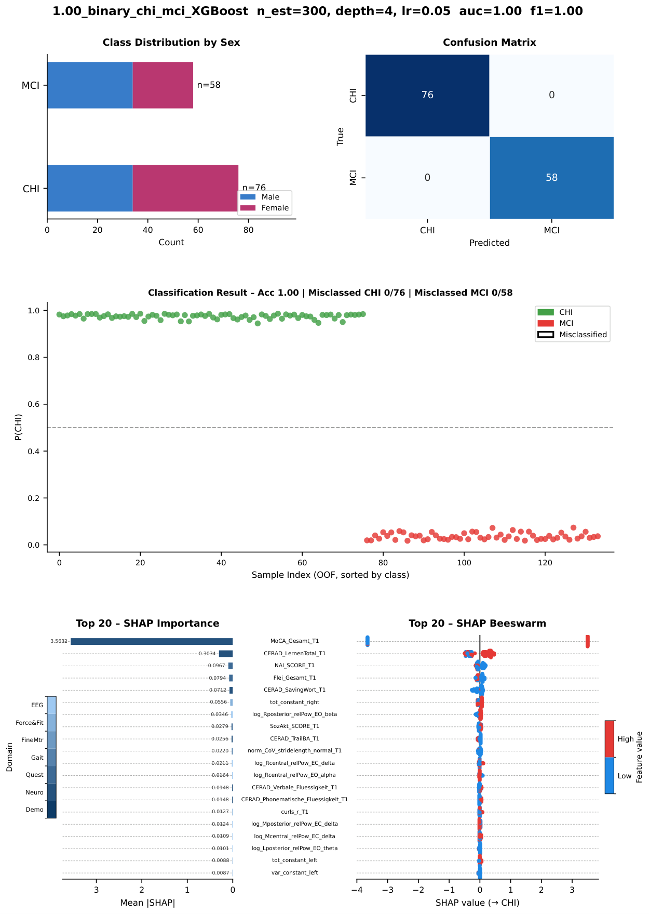

With pMCI excluded, XGBoost reached perfect out-of-fold separation on this subset (n=134). As with the impaired binary task, CERAD and MoCA features again drive most of the SHAP signal.

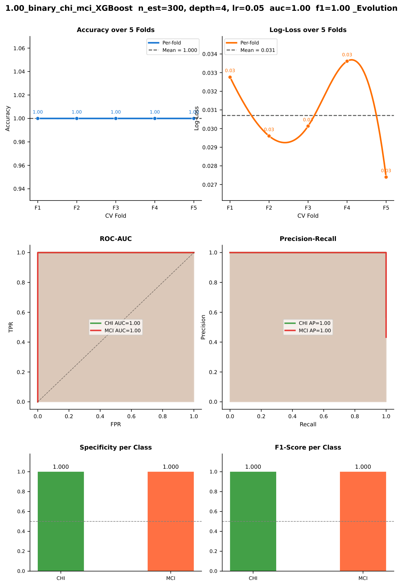

All five folds held at high accuracy (0.88–1.00). ROC and precision-recall curves show near-complete separation (AUROC 1.00), though this likely reflects overlap between neuropsychological scores and the clinical label rather than sensor-only discrimination.

### Binary_CHI_vs_impaired

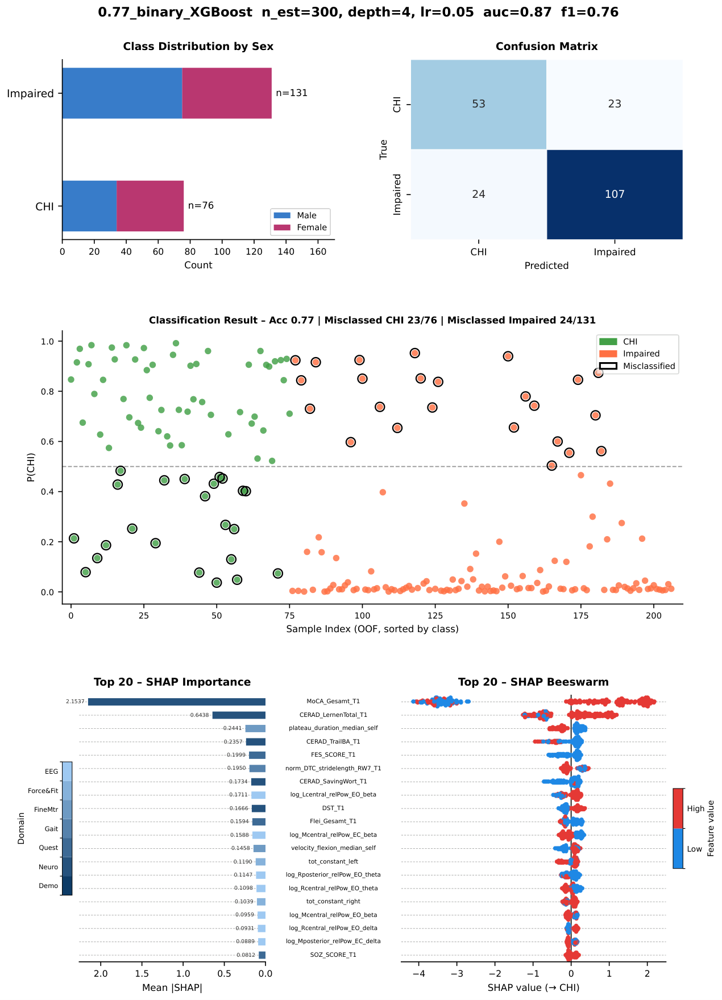

XGBoost correctly separated CHI from impaired individuals in the majority of cases. Looking at the SHAP plot, MoCA and CERAD scores dominate the top features — high scores consistently push predictions toward CHI, which makes sense given how closely those tests relate to the label.

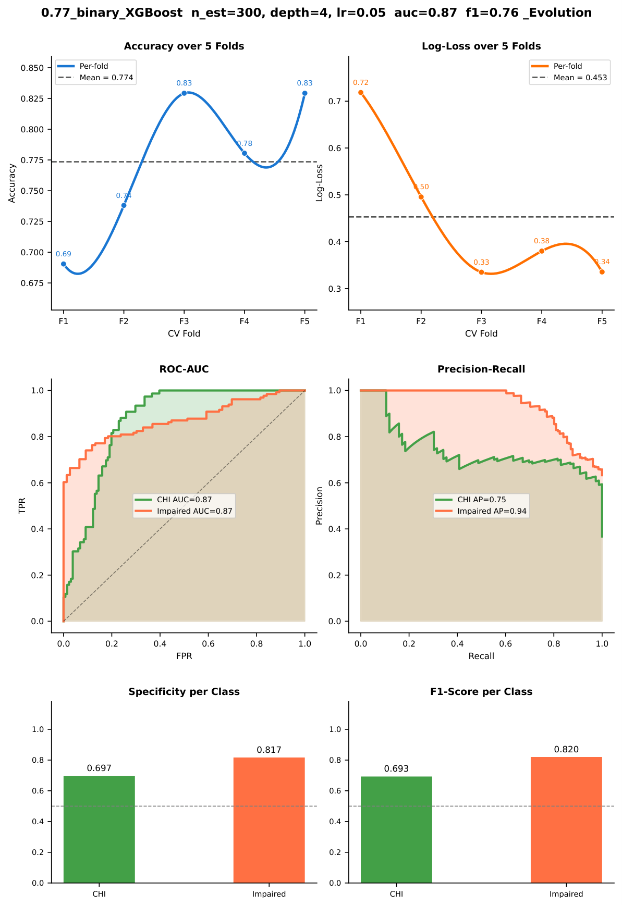

Across the 5 folds, accuracy stayed between 0.69 and 0.85, with no fold collapsing to chance — this is a stable result, not a lucky split. The ROC curves show good separation for both classes (AUC 0.87), and the precision-recall curves hold up reasonably well (AP 0.74 for CHI, 0.94 for Impaired).

### multiclass_CHI_pMCI_MCI

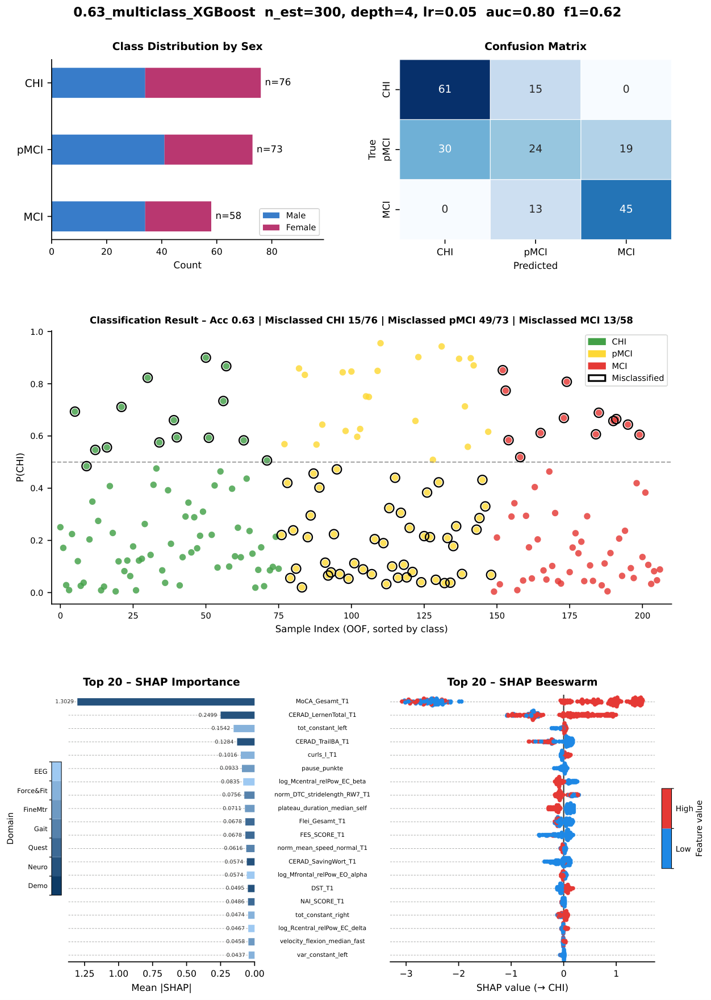

The three-way task is noticeably harder, especially separating pMCI from MCI. The confusion matrix shows more misclassifications between these two adjacent groups, which is expected, the distinction between them is subtler than the difference between either and CHI.

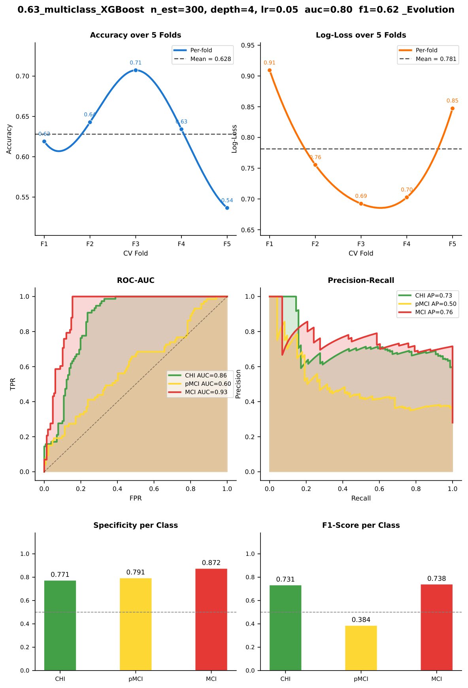

The multiclass ROC (AUROC 0.80) is still reasonable for a three-class problem at this sample size, but the per-class F1 scores show more variation, confirming that pMCI is the hardest group to classify reliably.

## 7.2 wo_CERAD_demo

CERAD, MoCA, and demographics (sex, age, years of education) are removed in this run so the models must rely on questionnaire, gait, fine motor, force and fitness, and EEG features — a stricter test of whether sensor domains carry signal on their own, without scores that closely mirror the clinical label.

### Best model summary

| Task | model | accuracy | roc_auc | avg_precision | f1_macro | precision_CHI | recall_CHI | f1_CHI | specificity_CHI | misclassified_CHI |
|------|-------|----------|---------|---------------|----------|---------------|------------|--------|-----------------|-------------------|
| Binary CHI vs MCI | LR | 0.6269 | 0.7015 | 0.7784 | 0.6145 | 0.6585 | 0.7105 | 0.6835 | 0.7105 | 22 |
| Binary CHI vs Impaired | LR | 0.5507 | 0.5862 | 0.4491 | 0.5295 | 0.4023 | 0.4605 | 0.4294 | 0.4605 | 41 |
| Multiclass CHI / pMCI / MCI | LR | 0.3768 | 0.5774 | 0.3990 | 0.3736 | 0.4375 | 0.4605 | 0.4487 | 0.6565 | 41 |

### Binary_CHI_vs_MCI

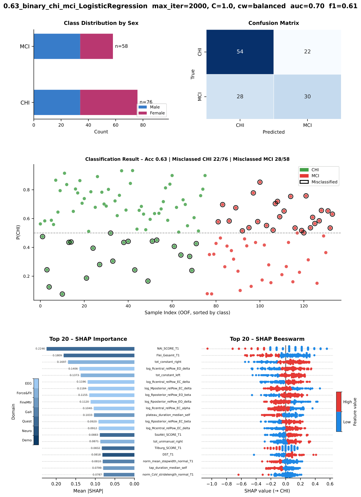

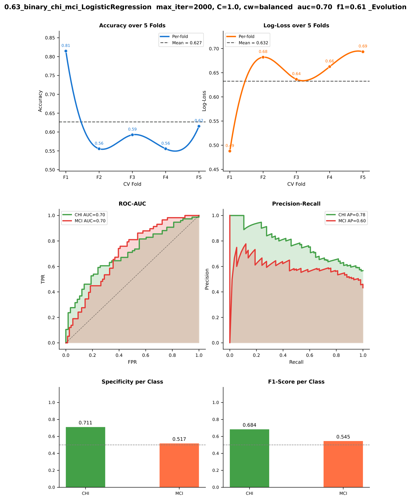

Without CERAD and MoCA, Logistic Regression remains the strongest model on this task (AUROC 0.70), but performance is well below the All_features run.

### Binary_CHI_vs_impaired

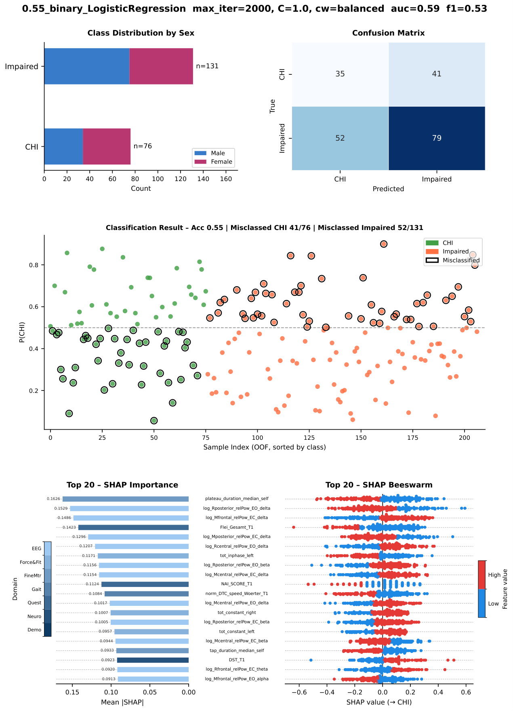

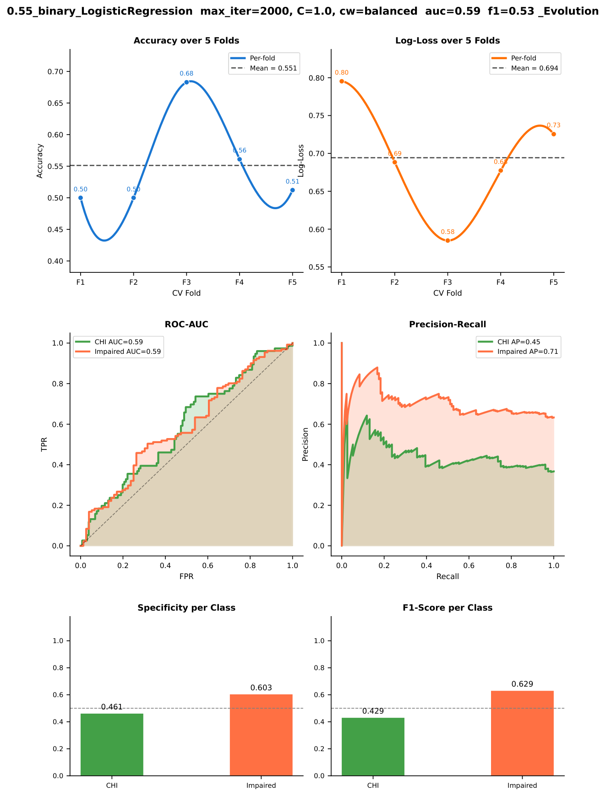

Once CERAD, MoCA, and demographics are removed, performance drops sharply across all models. AUROC falls to near chance (0.50–0.58) and accuracy drops by 15–25 points compared to the full-feature run.

### multiclass_CHI_pMCI_MCI

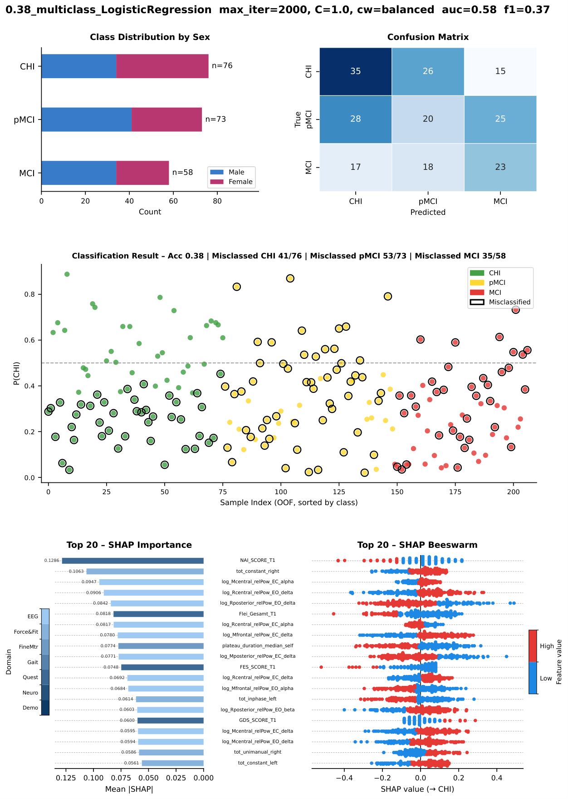

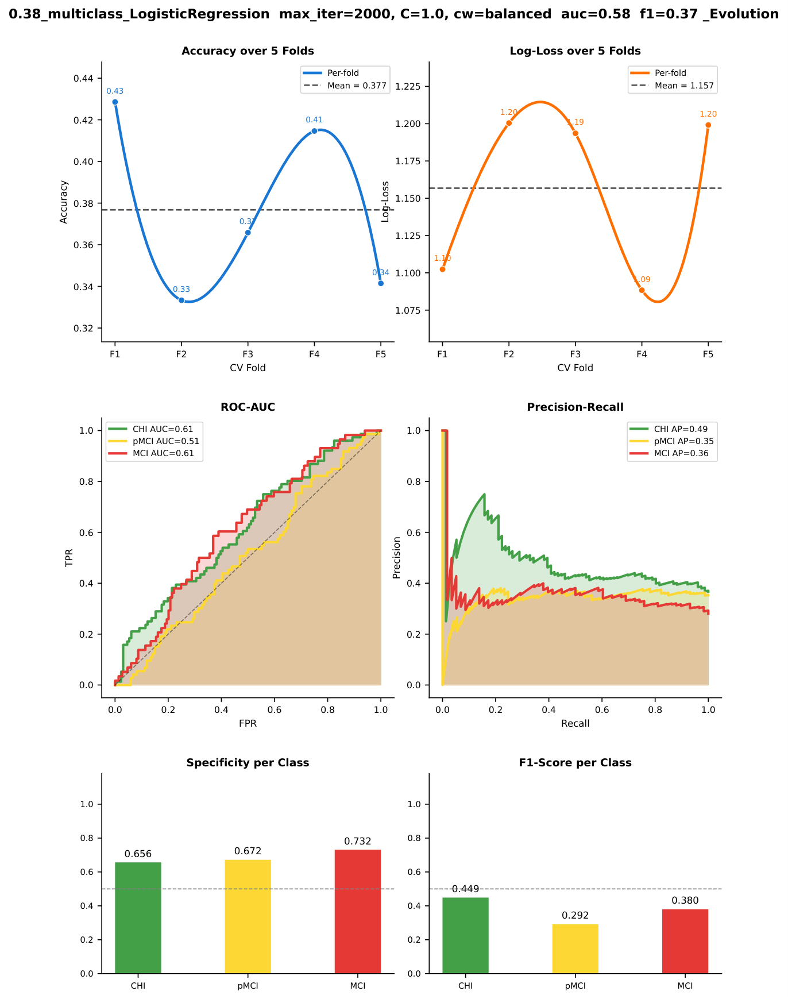

Multiclass performance without neuropsychological scores stays close to chance (AUROC 0.58), confirming that the three-way task is difficult when label-proximal features are excluded.

# 8. Conclusion

XGBoost performed best in the All_features run, with an AUROC of 0.87 on the binary task and 0.80 on the multiclass task. Gradient boosting handles mixed-scale, moderately noisy tabular data well, and its ability to capture feature interactions is a good fit for this kind of multi-domain dataset. The binary task (CHI vs. impaired) was much easier for all models than the three-way task, which is not surprising, distinguishing pMCI from MCI is a finer and harder call.

The more important finding, though, is the gap between the two runs. When CERAD, MoCA, and demographics are removed, every model drops close to random guessing (chance). This tells us that most of the predictive power in the full-feature run was coming from scores that are already closely tied to the diagnostic label, not from the gait, EEG, fine-motor, or fitness measurements and our SHAP plots confirm this, MoCA and CERAD subtests sit at the top of the feature importance rankings by a wide margin in the full-feature run, while EEG and gait features appear lower down with smaller, more mixed contributions. That is why we excluded the top feature of the first run, wo_CERAD_demo run give us more a honest estimate of what these domains can actually detect independently.
